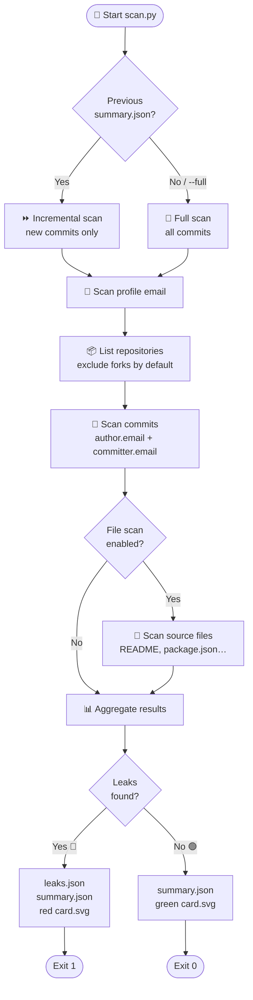
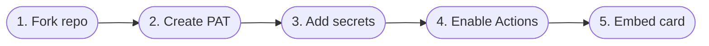
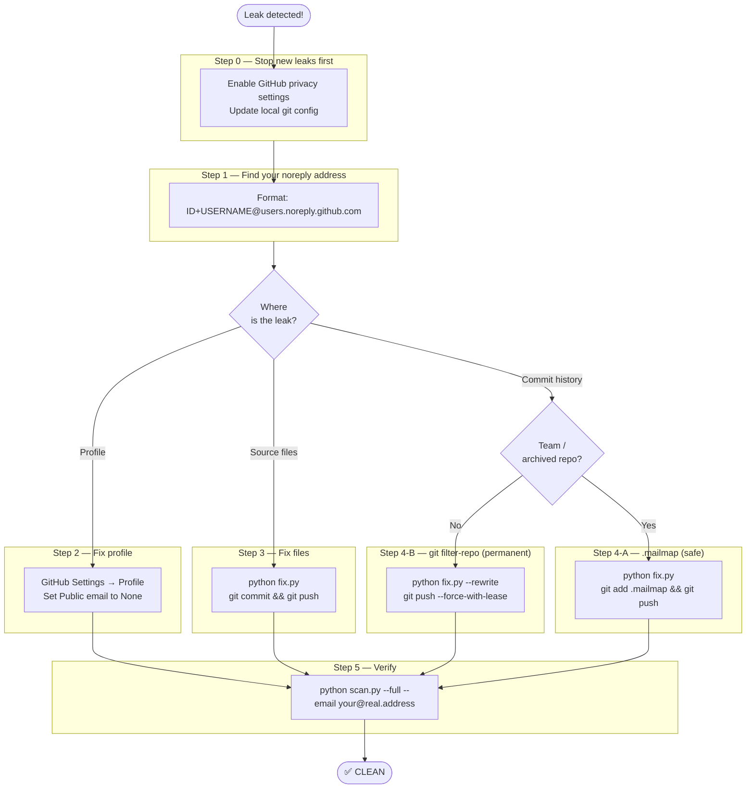

# github-leak-check

**Language / 语言 / 言語:** English | [中文](README.zh.md) | [日本語](README.ja.md)

---

[](LICENSE)
[](https://www.python.org/)
[](https://github.com/long-910/github_leak_check/actions/workflows/scan.yml)
[](https://github.com/long-910/github_leak_check/releases)
[](https://github.com/marketplace/actions/github-email-leak-check)

Scan GitHub commits, file contents, and user profiles for non-`noreply` email addresses — and display the result as a live badge on your GitHub profile.

<!-- Status card — auto-updated daily by GitHub Actions -->
<!-- Replace USERNAME with your GitHub username after forking -->
<!--  -->

> **Status card preview**
>
> | Clean | Leaks Found | Rate Limited | Error |
> |:---:|:---:|:---:|:---:|
> |  |  |  |  |

---

## 🔍 How it works



---

## 📖 Background & motivation

### "I have Keep my email addresses private — so why am I getting GitHub-related spam?"

GitHub's **"Keep my email addresses private"** setting (Settings → Emails) makes _future_ commits use your `@users.noreply.github.com` address. However, it does **not** retroactively fix your commit history.

Common ways a real email address can still be exposed:

| Scenario | Why it leaks |
|---|---|
| **Old commits** | Made before enabling the setting, or from a machine whose `git config` still had a real address |
| **Force-push / rebase** | Rewrites history but re-publishes old author metadata that was already in the tree |
| **Cloned & re-pushed repos** | Migrating a project from another host preserves the original author email in every commit |
| **Public profile** | Email field on your GitHub profile is visible to anyone and easily scraped |
| **Source files** | `package.json`, `setup.py`, README, `.mailmap`, etc. that contain your address as author metadata |

### How spam bots find you

Bots continuously scrape GitHub's commit API and search index. A single commit with a real email in a public repo is enough — they harvest it, add it to mailing lists, and the spam starts.

**This tool** lets you audit your entire GitHub account automatically and on a regular schedule, so you know exactly where your address is still exposed before the bots find it.

---

## ✨ What it does

| # | Feature | Details |
|---|---|---|
| 1 | **Commit scan** | Checks every commit's `author.email` and `committer.email` across all your repos |
| 2 | **File scan** | Searches README, package.json, pyproject.toml, etc. for email-like patterns |
| 3 | **Profile scan** | Checks if your public GitHub profile has an email set |
| 4 | **Smart filter** | Flags anything that isn't a `@users.noreply.github.com` or other bot/noreply address |
| 5 | **Incremental** | On repeat runs, only commits after the previous scan's timestamp are checked |
| 6 | **Fork-safe** | Forked repos are skipped unless `--include-forks` is specified |

**Output files:**

```
results/
├── summary.json   ← aggregated counts, no real emails (committed to repo)
├── card.svg       ← embeddable status card (committed to repo)
└── leaks.json     ← full details with real addresses (gitignored, never committed)
```

---

## ⚡ Use as a GitHub Action

Add to any repository's workflow in two lines:

```yaml
- uses: actions/checkout@v4

- name: Email leak scan
  uses: long-910/github_leak_check@v1
  with:
    github-token: ${{ secrets.GH_PAT }}
```

### All inputs

| Input | Required | Default | Description |
|---|---|---|---|
| `github-token` | ✅ | — | PAT with `repo` + `read:user` scopes |
| `username` | — | repo owner | GitHub username to scan |
| `target-emails` | — | _(all)_ | Comma-separated addresses to watch |
| `max-commits` | — | `500` | Max commits per repo |
| `include-forks` | — | `false` | Also scan forked repos |
| `no-files` | — | `false` | Skip file content scan |
| `full-scan` | — | `false` | Ignore previous scan timestamp |
| `max-rate-wait` | — | `60` | Abort if rate-limit wait > N seconds |
| `output-dir` | — | `results` | Output directory |

### Outputs

| Output | Description |
|---|---|
| `status` | `CLEAN` \| `LEAKS_FOUND` \| `RATE_LIMITED` \| `ERROR` |
| `leak-count` | Number of leaks found |
| `exit-code` | `0` clean · `1` leaks · `2` rate limited |

### Full example workflow

```yaml
name: Email Leak Check

on:
  schedule:
    - cron: '0 3 * * *'
  workflow_dispatch:

permissions:
  contents: write
  actions: write

jobs:
  scan:
    runs-on: ubuntu-latest
    steps:
      - uses: actions/checkout@v4

      - name: Run scan
        id: scan
        uses: long-910/github_leak_check@v1
        with:
          github-token:  ${{ secrets.GH_PAT }}
          target-emails: ${{ secrets.TARGET_EMAILS }}
          max-rate-wait: '60'

      - name: Cancel if rate limited
        if: steps.scan.outputs.exit-code == '2'
        env:
          GH_TOKEN: ${{ secrets.GITHUB_TOKEN }}
        run: gh run cancel "${{ github.run_id }}"

      - name: Commit results
        if: steps.scan.outputs.exit-code != '2'
        env:
          GITHUB_TOKEN: ${{ secrets.GITHUB_TOKEN }}
        run: |
          git config user.email "41898282+github-actions[bot]@users.noreply.github.com"
          git config user.name "github-actions[bot]"
          git add results/summary.json results/card.svg
          git diff --staged --quiet || \
            git commit -m "chore: update scan results [skip ci]" && git push
```

---

## 🛠️ Setup (self-hosted / fork)



### 1. Fork this repo

Fork to your own account so GitHub Actions runs under your identity.

### 2. Create a Personal Access Token

Go to **GitHub → Settings → Developer settings → Personal access tokens → Fine-grained tokens** and create a token with:

| Permission | Access |
|---|---|
| **Contents** | Read-only (all repos) |
| **Metadata** | Read-only |
| **Email addresses** | Read-only (under Account permissions) |

> Classic PAT: `repo` + `read:user` scopes work too.

### 3. Add secrets to the repo

In your fork: **Settings → Secrets and variables → Actions → New repository secret**

| Secret name | Required | Value |
|---|---|---|
| `GH_PAT` | ✅ | The token from step 2 |
| `TARGET_EMAILS` | — | Comma-separated addresses to watch, e.g. `you@work.com,old@isp.net` |

> If `TARGET_EMAILS` is not set, the scanner flags **all** non-noreply addresses.
> If it is set, only those specific addresses are reported.

### 4. Enable Actions

Go to the **Actions** tab in your fork and enable workflows if prompted.
The scan runs automatically every day at 03:00 UTC and on every push to `main`.
You can also trigger it manually from the Actions tab.

### 5. Embed the card in your profile README

Add this line to your `USERNAME/USERNAME` profile repository README:

```markdown

```

Replace `USERNAME` with your actual GitHub username.

---

## 💻 Run locally

First, install dependencies:

```bash
pip install -r requirements.txt
```

### macOS / Linux

```bash
# Scan commits since the last run (default — reads scanned_at from summary.json)
GH_PAT=ghp_... python scan.py YOUR_USERNAME --verbose

# Force a full scan regardless of previous results
GH_PAT=ghp_... python scan.py YOUR_USERNAME --full

# Scan commits after a specific date
GH_PAT=ghp_... python scan.py YOUR_USERNAME --since 2026-01-01T00:00:00Z

# Also scan forked repositories (excluded by default)
GH_PAT=ghp_... python scan.py YOUR_USERNAME --include-forks

# Scan for a specific email address only
GH_PAT=ghp_... python scan.py YOUR_USERNAME --email your@example.com

# Scan for multiple specific addresses
GH_PAT=ghp_... python scan.py YOUR_USERNAME --email work@example.com --email personal@example.com

# Generate card from existing summary
python generate_card.py

# Scan without file content (faster)
GH_PAT=ghp_... python scan.py YOUR_USERNAME --no-files

# Increase commit depth (default: 500 per repo)
GH_PAT=ghp_... python scan.py YOUR_USERNAME --max-commits 2000
```

### Windows — PowerShell

```powershell
$env:GH_PAT = "ghp_..."

# Scan commits since the last run (default)
python scan.py YOUR_USERNAME --verbose

# Force a full scan
python scan.py YOUR_USERNAME --full

# Scan commits after a specific date
python scan.py YOUR_USERNAME --since 2026-01-01T00:00:00Z

# Also scan forked repositories
python scan.py YOUR_USERNAME --include-forks

# Scan for a specific email address only
python scan.py YOUR_USERNAME --email your@example.com

# Scan for multiple specific addresses
python scan.py YOUR_USERNAME --email work@example.com --email personal@example.com

# Generate card
python generate_card.py

# Scan without file content (faster)
python scan.py YOUR_USERNAME --no-files

# Increase commit depth
python scan.py YOUR_USERNAME --max-commits 2000
```

### Windows — Command Prompt (cmd.exe)

```cmd
set GH_PAT=ghp_...

REM Scan commits since the last run (default)
python scan.py YOUR_USERNAME --verbose

REM Force a full scan
python scan.py YOUR_USERNAME --full

python generate_card.py
```

---

## 🚨 What to do when a leak is detected



### Step 0 — Stop new leaks immediately (do this first)

Before fixing history, prevent further exposure:

1. **GitHub Settings → Emails**
   - Check **"Keep my email addresses private"**
   - Check **"Block command line pushes that expose my email"**

2. **Update your local git config** so every new commit uses the noreply address:
   ```bash
   # Find your noreply address in GitHub Settings → Emails
   git config --global user.email "ID+USERNAME@users.noreply.github.com"
   ```

3. **Verify** the change took effect:
   ```bash
   git config --global user.email
   # Should print: ID+USERNAME@users.noreply.github.com
   ```

---

### Step 1 — Find your noreply address

Your GitHub noreply address has the format: `ID+USERNAME@users.noreply.github.com`

Find your numeric ID:
```bash
curl https://api.github.com/users/YOUR_USERNAME | grep '"id"'
# or open: https://api.github.com/users/YOUR_USERNAME
```

Example: if your ID is `12345678` and username is `alice`, your noreply address is:
`12345678+alice@users.noreply.github.com`

---

### Step 2 — Fix profile leak

If the scan found a **profile** leak:

1. Go to **https://github.com/settings/profile**
2. Scroll to **"Public email"**
3. Set it to **"Don't show my email address"**
4. Save

---

### Step 3 — Fix file content leaks

If the scan found emails inside source files (README, package.json, etc.):

```bash
# Interactive replacement
python fix.py

# Or specify the replacement upfront
python fix.py --replace "old@example.com=12345+alice@users.noreply.github.com"
```

Then commit and push normally:
```bash
git add .
git commit -m "fix: replace leaked email in source files"
git push
```

---

### Step 4 — Fix commit history leaks

This is the most complex part. Choose the approach that fits your situation:

#### Option A: `.mailmap` — safe, no history rewrite (recommended first)

`.mailmap` tells Git to _display_ a different author email in `git log`, `git shortlog`, and on the GitHub contributors page. It does **not** rewrite actual commit objects — so it's completely safe and reversible.

```bash
python fix.py   # generates .mailmap automatically
git add .mailmap
git commit -m "chore: add mailmap to mask leaked email"
git push
```

> **Limitation:** The raw commit objects still contain the old email and are accessible via the GitHub API. Determined scrapers can still find it. Use Option B to fully erase it.

#### Option B: `git filter-repo` — full history rewrite (permanent fix)

This permanently rewrites every matching commit. **Back up your repo first.**

```bash
# 1. Preview what will change (dry run)
python fix.py --dry-run --rewrite

# 2. Apply the rewrite
python fix.py --rewrite

# 3. Force-push all branches
git push --force-with-lease origin main

# 4. If you have other branches
git push --force-with-lease origin --all
```

> ⚠️ **After a force-push:**
> - All collaborators must `git fetch && git reset --hard origin/main` or re-clone
> - Existing forks on GitHub still contain the old history — contact their owners
> - GitHub's search index cache clears within a few days

#### Which option to choose?

| Situation | Recommendation |
|---|---|
| Personal repo, no collaborators | **Option B** (full rewrite) |
| Team repo, active collaborators | **Option A** first; coordinate Option B during a freeze window |
| Archived / read-only repo | **Option A** (safe, no disruption) |
| Email already in many forks | **Option A** (forks are out of your control anyway) |

---

### Step 5 — Verify the fix

Run the scanner again with `--full` to confirm nothing remains:

```bash
GH_PAT=ghp_... python scan.py YOUR_USERNAME --full --email your@real.address
```

A clean result looks like:
```
✅ Status: CLEAN
   Leaks found: 0
```

---

### Fixing leaks with `fix.py` (quick reference)

```bash
# Interactive — prompts for replacement
python fix.py

# Non-interactive
python fix.py --replace "old@example.com=12345+alice@users.noreply.github.com"

# Preview without applying
python fix.py --dry-run

# Full history rewrite (requires confirmation)
python fix.py --rewrite
```

**What `fix.py` does:**

| Step | Action | Safe? |
|---|---|---|
| 1 | Generate/update `.mailmap` — rewrites `git log` display | ✅ Safe |
| 2 | Replace emails in local working-tree files | ✅ Safe |
| 3 | Rewrite git history with `git filter-repo` | ⚠️ Destructive — opt-in only |
| 4 | Print instructions for profile leaks | — Manual |

---

## 🛡️ Safe email patterns (not flagged)

| Pattern | Example |
|---|---|
| `@users.noreply.github.com` | `12345+user@users.noreply.github.com` |
| `noreply@github.com` | `noreply@github.com` |
| `[bot]@` | `dependabot[bot]@users.noreply.github.com` |
| `@noreply.github.com` | `actions@noreply.github.com` |

Everything else is flagged as a potential leak.

---

## ⏱️ Rate limits

With a PAT the GitHub API allows **5,000 requests/hour**.
The scanner handles rate limiting automatically (waits on `X-RateLimit-Reset`).
Large accounts (100+ repos, thousands of commits) may need multiple runs or a higher `--max-commits` value spread across days.

---

## 🔄 Self-check

This repo's own GitHub Actions workflow uses `41898282+github-actions[bot]@users.noreply.github.com` for all commits — it won't trigger its own scanner.

---

## 📄 License

[](LICENSE)

MIT
