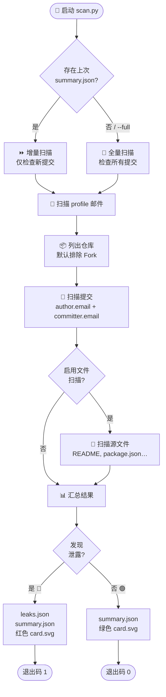
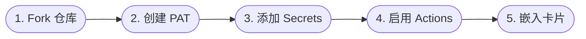
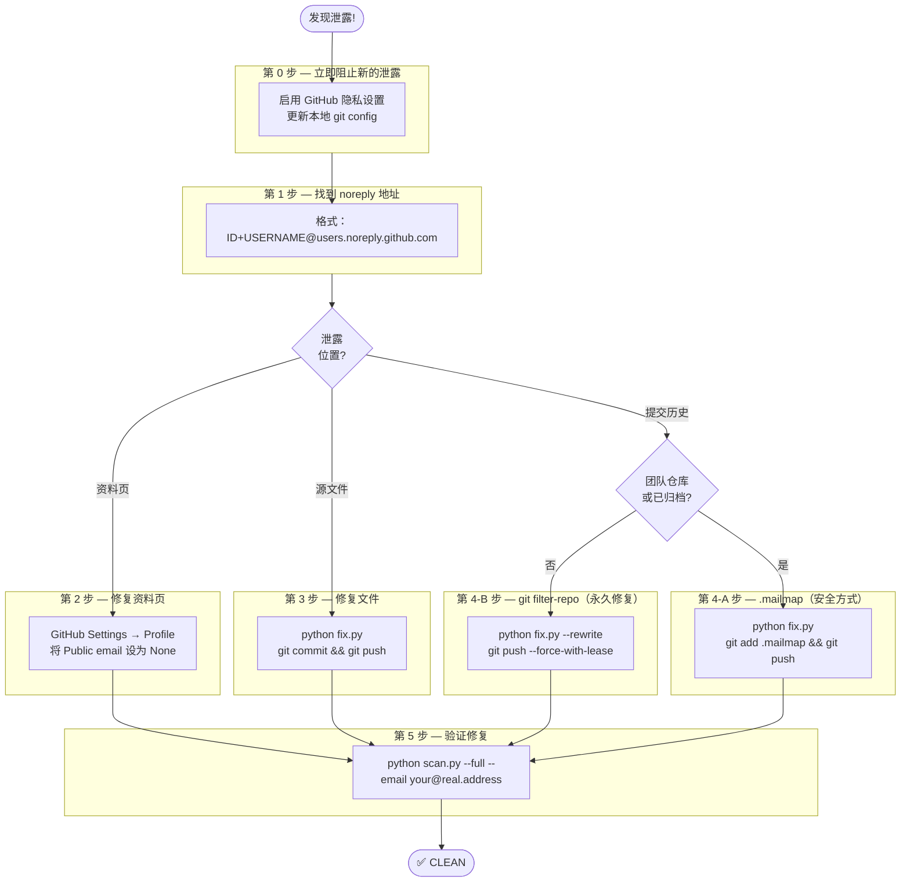

# github-leak-check

**Language / 语言 / 言語:** [English](README.md) | 中文 | [日本語](README.ja.md)

---

[](LICENSE)
[](https://www.python.org/)
[](https://github.com/long-910/github_leak_check/actions/workflows/scan.yml)
[](https://github.com/long-910/github_leak_check/releases)
[](https://github.com/marketplace/actions/github-email-leak-check)

扫描 GitHub 提交记录、文件内容和用户资料中的非 `noreply` 邮件地址，并将结果以动态徽章的形式展示在你的 GitHub 主页上。

<!-- 状态卡片 — 由 GitHub Actions 每日自动更新 -->
<!-- 将 USERNAME 替换为你的 GitHub 用户名后取消注释 -->
<!--  -->

> **状态卡片预览**
>
> | 安全 | 发现泄露 | 速率受限 | 错误 |
> |:---:|:---:|:---:|:---:|
> |  |  |  |  |

---

## 🚀 推荐：作为 GitHub Action 使用（3 步，无需本地环境）

> **这是本工具的推荐使用方式。**
> Fork → 添加密钥 → 完成。每天自动扫描，Profile 状态卡片自动更新。

### 第 1 步 — Fork 本仓库

点击页面右上角的 **Fork**。GitHub Actions 将以你自己的身份运行。

### 第 2 步 — 将 Personal Access Token 添加为 Secret

1. 前往 **Settings → Developer settings → Personal access tokens → Fine-grained tokens**，
   创建具有 **Contents**（读取）、**Metadata**（读取）、**Email addresses**（读取）权限的 Token。
2. 在你的 Fork 中前往 **Settings → Secrets and variables → Actions → New repository secret**，
   将 Token 保存为 `GH_PAT`。

> 可选：添加 `TARGET_EMAILS`（逗号分隔）以仅监测特定邮件地址。

### 第 3 步 — 启用 Actions 并嵌入卡片

前往 Fork 的 **Actions** 标签页并启用工作流。
首次推送到 `main` 分支时立即触发扫描，之后每天 03:00 UTC 自动运行。

将动态状态卡片嵌入你的主页 README（`USERNAME/USERNAME`）：

```markdown

```

**完成。** 无需本地 Python 环境，结果会自动提交回你的 Fork。

---

## 🔍 工作原理



---

## 📖 背景与动机

### "我已开启「保护邮件地址」设置，为什么还会收到与 GitHub 相关的垃圾邮件？"

GitHub 的 **"Keep my email addresses private"**（Settings → Emails）只对**未来的**提交生效，会将提交邮件替换为 `@users.noreply.github.com`。但它**不会**自动修复历史提交记录。

常见的邮件泄露场景：

| 场景 | 泄露原因 |
|---|---|
| **旧提交记录** | 开启设置之前的提交，或本地 `git config` 仍配置了真实邮件 |
| **强制推送 / rebase** | 重写历史时，旧的 author 元数据会随 commit 对象再次暴露 |
| **从其他平台迁移的仓库** | 迁移过来的仓库保留了原始作者邮件 |
| **公开资料页** | GitHub 个人资料中的邮件字段对任何人可见，容易被抓取 |
| **源文件** | `package.json`、`setup.py`、README、`.mailmap` 等文件中直接写入了邮件地址 |

### 垃圾邮件机器人如何找到你

爬虫机器人会持续抓取 GitHub 的提交 API 和搜索索引。只要一个公开仓库的任意提交中包含真实邮件，它就可能被收录到邮件列表，随后垃圾邮件便接踵而至。

**本工具**可以自动、定期审查你的整个 GitHub 账号，让你在机器人发现之前，率先掌握邮件地址的暴露情况。

---

## ✨ 功能说明

| # | 功能 | 说明 |
|---|---|---|
| 1 | **提交记录扫描** | 检查你所有仓库中每条提交的 `author.email` 和 `committer.email` |
| 2 | **文件内容扫描** | 在 README、package.json、pyproject.toml 等文件中搜索邮件地址模式 |
| 3 | **资料页扫描** | 检查你的 GitHub 公开资料是否设置了邮件地址 |
| 4 | **智能过滤** | 将所有非 `@users.noreply.github.com` 地址标记为潜在泄露 |
| 5 | **增量扫描** | 重复运行时，仅检查上次扫描时间戳之后的新提交 |
| 6 | **默认排除 Fork** | 除非指定 `--include-forks`，否则跳过所有 Fork 的仓库 |

**输出文件说明：**

```
results/
├── summary.json   ← 汇总统计，不含真实邮件地址（会提交到仓库）
├── card.svg       ← 用于嵌入展示的状态卡片（会提交到仓库）
└── leaks.json     ← 包含真实地址的完整详情（.gitignore 中，绝不提交）
```

---

## ⚙️ GitHub Actions — 高级配置

在任意仓库的工作流中两行即可接入：

```yaml
- uses: actions/checkout@v4

- name: 邮件泄露扫描
  uses: long-910/github_leak_check@v1
  with:
    github-token: ${{ secrets.GH_PAT }}
```

### 所有输入参数

| 参数 | 必填 | 默认值 | 说明 |
|---|---|---|---|
| `github-token` | ✅ | — | 具有 `repo` + `read:user` 权限的 PAT |
| `username` | — | 仓库所有者 | 要扫描的 GitHub 用户名 |
| `target-emails` | — | _(全部)_ | 逗号分隔的监测地址 |
| `max-commits` | — | `500` | 每个仓库最多扫描的提交数 |
| `include-forks` | — | `false` | 同时扫描 Fork 的仓库 |
| `no-files` | — | `false` | 跳过文件内容扫描 |
| `full-scan` | — | `false` | 忽略上次扫描时间戳 |
| `max-rate-wait` | — | `60` | 超过 N 秒的等待则中止 |
| `output-dir` | — | `results` | 输出目录 |

### 输出

| 输出 | 说明 |
|---|---|
| `status` | `CLEAN` \| `LEAKS_FOUND` \| `RATE_LIMITED` \| `ERROR` |
| `leak-count` | 检测到的泄露数量 |
| `exit-code` | `0` 无泄露 · `1` 有泄露 · `2` 超出速率限制 |

### 完整示例工作流

```yaml
name: Email Leak Check

on:
  schedule:
    - cron: '0 3 * * *'
  workflow_dispatch:

permissions:
  contents: write
  actions: write

jobs:
  scan:
    runs-on: ubuntu-latest
    steps:
      - uses: actions/checkout@v4

      - name: Run scan
        id: scan
        uses: long-910/github_leak_check@v1
        with:
          github-token:  ${{ secrets.GH_PAT }}
          target-emails: ${{ secrets.TARGET_EMAILS }}
          max-rate-wait: '60'

      - name: Cancel if rate limited
        if: steps.scan.outputs.exit-code == '2'
        env:
          GH_TOKEN: ${{ secrets.GITHUB_TOKEN }}
        run: gh run cancel "${{ github.run_id }}"

      - name: Commit results
        if: steps.scan.outputs.exit-code != '2'
        env:
          GITHUB_TOKEN: ${{ secrets.GITHUB_TOKEN }}
        run: |
          git config user.email "41898282+github-actions[bot]@users.noreply.github.com"
          git config user.name "github-actions[bot]"
          git add results/summary.json results/card.svg
          git diff --staged --quiet || \
            git commit -m "chore: update scan results [skip ci]" && git push
```

---

## 🛠️ 配置详情



### PAT 所需权限

| 权限 | 访问级别 |
|---|---|
| **Contents** | Read-only（所有仓库） |
| **Metadata** | Read-only |
| **Email addresses** | Read-only（Account permissions 下） |

> 经典 PAT 也可用：勾选 `repo` + `read:user` 权限。

### Secrets 说明

| 密钥名称 | 是否必填 | 值 |
|---|---|---|
| `GH_PAT` | ✅ | 上述 Fine-grained PAT |
| `TARGET_EMAILS` | — | 要监测的邮件地址（逗号分隔），例如 `you@work.com,old@isp.net` |

> 若未设置 `TARGET_EMAILS`，扫描器会标记仓库中**所有**非 noreply 邮件地址。
> 若已设置，则只报告这些特定地址的泄露情况。

扫描将在每天 03:00 UTC 及每次推送到 `main` 分支时自动执行。
也可在 **Actions** 标签页 → **Email Leak Scan** → **Run workflow** 手动触发。

---

## 💻 本地运行（进阶 / 调试用）

> 大多数用户应使用上方的 GitHub Actions 方式——无需本地环境。
> 仅在提交前测试或调试扫描结果时才需要本地运行。

首先安装依赖：

```bash
pip install -r requirements.txt
```

### macOS / Linux

```bash
# 仅扫描上次检查后的新提交（默认行为——自动读取 summary.json 中的时间戳）
GH_PAT=ghp_... python scan.py YOUR_USERNAME --verbose

# 强制全量扫描（忽略上次扫描时间）
GH_PAT=ghp_... python scan.py YOUR_USERNAME --full

# 从指定日期起扫描
GH_PAT=ghp_... python scan.py YOUR_USERNAME --since 2026-01-01T00:00:00Z

# 同时扫描 Fork 的仓库（默认排除）
GH_PAT=ghp_... python scan.py YOUR_USERNAME --include-forks

# 只检测指定邮件地址
GH_PAT=ghp_... python scan.py YOUR_USERNAME --email your@example.com

# 同时检测多个地址
GH_PAT=ghp_... python scan.py YOUR_USERNAME --email work@example.com --email personal@example.com

# 从已有摘要生成卡片
python generate_card.py

# 跳过文件内容扫描（更快）
GH_PAT=ghp_... python scan.py YOUR_USERNAME --no-files

# 增加每仓库的提交扫描深度（默认：500）
GH_PAT=ghp_... python scan.py YOUR_USERNAME --max-commits 2000
```

### Windows — PowerShell

```powershell
$env:GH_PAT = "ghp_..."

# 仅扫描上次检查后的新提交（默认）
python scan.py YOUR_USERNAME --verbose

# 强制全量扫描
python scan.py YOUR_USERNAME --full

# 从指定日期起扫描
python scan.py YOUR_USERNAME --since 2026-01-01T00:00:00Z

# 同时扫描 Fork 的仓库
python scan.py YOUR_USERNAME --include-forks

# 只检测指定邮件地址
python scan.py YOUR_USERNAME --email your@example.com

# 同时检测多个地址
python scan.py YOUR_USERNAME --email work@example.com --email personal@example.com

# 生成卡片
python generate_card.py

# 跳过文件内容扫描（更快）
python scan.py YOUR_USERNAME --no-files

# 增加提交扫描深度
python scan.py YOUR_USERNAME --max-commits 2000
```

### Windows — 命令提示符（cmd.exe）

```cmd
set GH_PAT=ghp_...

REM 仅扫描上次检查后的新提交（默认）
python scan.py YOUR_USERNAME --verbose

REM 强制全量扫描
python scan.py YOUR_USERNAME --full

python generate_card.py
```

---

## 🚨 检测到泄露后的处理方法



### 第 0 步 — 立即阻止新的泄露（最优先执行）

在修复历史之前，先切断泄露源头：

1. **GitHub Settings → Emails**
   - 勾选 **"Keep my email addresses private"**
   - 勾选 **"Block command line pushes that expose my email"**

2. **更新本地 git 配置**，让今后的提交自动使用 noreply 地址：
   ```bash
   # 在 GitHub Settings → Emails 页面可以找到你的 noreply 地址
   git config --global user.email "ID+USERNAME@users.noreply.github.com"
   ```

3. **确认生效：**
   ```bash
   git config --global user.email
   # 应输出：ID+USERNAME@users.noreply.github.com
   ```

---

### 第 1 步 — 找到你的 noreply 地址

格式：`ID+USERNAME@users.noreply.github.com`

查找数字 ID：
```bash
curl https://api.github.com/users/YOUR_USERNAME | grep '"id"'
# 或直接打开：https://api.github.com/users/YOUR_USERNAME
```

示例：ID 为 `12345678`，用户名为 `alice`，则 noreply 地址为：
`12345678+alice@users.noreply.github.com`

---

### 第 2 步 — 修复资料页泄露

若扫描发现 **profile** 泄露：

1. 前往 **https://github.com/settings/profile**
2. 找到 **"Public email"**
3. 设置为 **"Don't show my email address"**
4. 保存

---

### 第 3 步 — 修复文件内容泄露

若扫描发现源文件（README、package.json 等）中含有邮件地址：

```bash
# 交互式替换
python fix.py

# 或直接指定替换内容
python fix.py --replace "old@example.com=12345+alice@users.noreply.github.com"
```

然后正常提交并推送：
```bash
git add .
git commit -m "fix: replace leaked email in source files"
git push
```

---

### 第 4 步 — 修复提交历史泄露

这是最复杂的部分，请根据实际情况选择方案：

#### 方案 A：`.mailmap` — 安全，无需重写历史（推荐优先尝试）

`.mailmap` 告诉 Git 在 `git log`、`git shortlog` 和 GitHub 贡献者页面中_显示_不同的作者邮件，但**不会**改写实际的 commit 对象，完全安全且可撤销。

```bash
python fix.py   # 自动生成 .mailmap
git add .mailmap
git commit -m "chore: add mailmap to mask leaked email"
git push
```

> **局限性：** 原始 commit 对象仍包含旧邮件，可通过 GitHub API 访问。要彻底消除，请使用方案 B。

#### 方案 B：`git filter-repo` — 彻底重写历史（永久修复）

该方法会永久重写每条匹配的提交。**操作前请务必备份仓库。**

```bash
# 1. 预览将要变更的内容（dry run）
python fix.py --dry-run --rewrite

# 2. 执行重写
python fix.py --rewrite

# 3. 强制推送所有分支
git push --force-with-lease origin main
git push --force-with-lease origin --all
```

> ⚠️ **强制推送后：**
> - 所有协作者需执行 `git fetch && git reset --hard origin/main` 或重新克隆
> - 其他人 Fork 的仓库仍保留旧历史 — 请联系 Fork 的所有者
> - GitHub 搜索索引缓存通常在数天内清除

#### 方案选择建议

| 情况 | 推荐方案 |
|---|---|
| 个人仓库，无协作者 | **方案 B**（彻底重写） |
| 团队仓库，有活跃协作者 | 先用**方案 A**；在代码冻结期协调执行方案 B |
| 已归档 / 只读仓库 | **方案 A**（安全，不影响协作） |
| 邮件已扩散到大量 Fork | **方案 A**（Fork 已无法控制） |

---

### 第 5 步 — 验证修复结果

使用 `--full` 参数重新扫描，确认邮件不再出现：

```bash
GH_PAT=ghp_... python scan.py YOUR_USERNAME --full --email your@real.address
```

干净的结果如下：
```
✅ Status: CLEAN
   Leaks found: 0
```

---

### fix.py 快速参考

```bash
# 交互式（逐一提示输入替换地址）
python fix.py

# 非交互式
python fix.py --replace "old@example.com=12345+alice@users.noreply.github.com"

# 预览，不实际修改
python fix.py --dry-run

# 彻底重写历史（需要确认）
python fix.py --rewrite
```

**fix.py 的修复步骤：**

| 步骤 | 操作 | 安全性 |
|---|---|---|
| 1 | 生成/更新 `.mailmap` — 重写 `git log` 显示 | ✅ 安全 |
| 2 | 替换本地工作区文件中的邮件地址 | ✅ 安全 |
| 3 | 使用 `git filter-repo` 重写 git 历史 | ⚠️ 破坏性 — 需主动启用 |
| 4 | 打印 Profile 泄露的手动修复说明 | — 手动操作 |

---

## 🛡️ 安全邮件模式（不会被标记）

| 模式 | 示例 |
|---|---|
| `@users.noreply.github.com` | `12345+user@users.noreply.github.com` |
| `noreply@github.com` | `noreply@github.com` |
| `[bot]@` | `dependabot[bot]@users.noreply.github.com` |
| `@noreply.github.com` | `actions@noreply.github.com` |

以上模式之外的所有邮件地址均会被标记为潜在泄露。

---

## ⏱️ API 速率限制

使用 PAT 时，GitHub API 允许每小时 **5,000 次请求**。
扫描器会自动处理速率限制（通过读取 `X-RateLimit-Reset` 自动等待）。
对于大账号（100+ 个仓库、数千条提交），可能需要多次运行或适当降低 `--max-commits` 的值。

---

## 🔄 自检说明

本仓库的 GitHub Actions 工作流使用 `41898282+github-actions[bot]@users.noreply.github.com` 进行所有提交——不会触发自身的扫描器。

---

## 📄 许可证

[](LICENSE)

MIT
